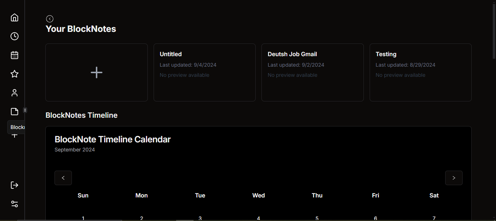
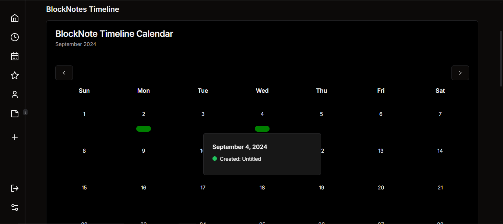
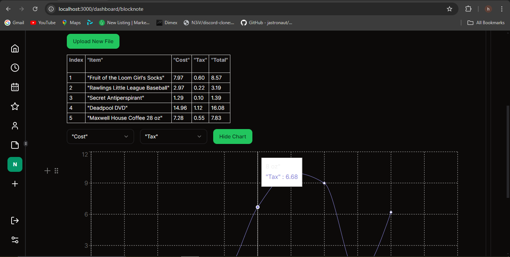

# Netflow - Probably the Best Productivity App

[Netflow](#) is an AI knowledge-based collaboration system.

## Focus. Flow. Achieve.
Netflow is designed to help you manage tasks and achieve your goals with ease.

## Installation

To get started with Netflow, follow these steps:

1. Install the dependencies:
   ```bash
   npm install

2. Run the development server:
```bash
    npm run dev

here's a simple publish artice click the visulize button then u will see the magic; here it detect the table from blocknotejs then it convert it to csv then it turn it into chart 

[text](https://netflow.netlify.app/en/publish/f624e421-38d0-4642-a93e-057a3edaca99)




