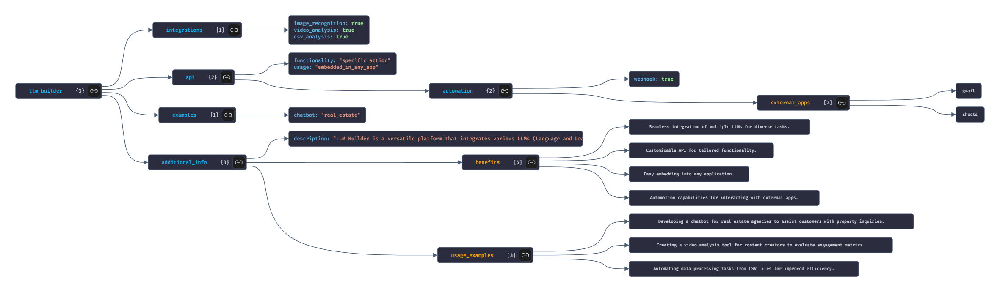

# Types of AI agents

There are different types of AI agents, each with its own strengths:

* **Simple reflex agents** react immediately based on their environment, like a thermostat raising the temperature when it gets cold.
* **Model-based reflex agents** have an internal model of the world, allowing them to consider different options before acting.
* **Goal-based agents** have specific objectives they're working towards, and can plan their actions accordingly.
* **Utility-based agents** can not only achieve goals but also weigh different options based on their desirability.
* **Learning agents** can improve their performance over time by learning from experience.
* **Multi-agent systems** involve multiple AI agents working together, which can be very complex.
* **Hierarchical agents** have a layered decision-making structure, where simpler tasks support more complex ones.

AI agents are being used in a variety of applications, from chatbots and virtual assistants to self-driving cars and stock trading algorithms. They're a rapidly evolving field with the potential to revolutionize many aspects of our lives.

You stopped this response

***

# Type LLM that works together :

1. **Multi-Agent System (MAS):** This is the most likely category. In an MAS, multiple intelligent agents, in your case different LLMs like LaMDA3, GPT-4, and DALL-E, work together to achieve a complex task. Each LLM would have its strengths and contribute unique capabilities to the workflow.
2. **Hierarchical Agent:** This could also be applicable depending on how the workflow functions. If there's a central agent coordinating the other LLMs, with LaMDA3 or GPT-4 making higher-level decisions and DALL-E acting on more specific instructions, then it exhibits a hierarchical structure.

Here's how your agent might be classified based on the level of collaboration between the LLMs:

* **Cooperative MAS:** If the LLMs actively share information and work towards a common goal within the workflow, it's a cooperative MAS.
* **Competitive MAS:** If the LLMs compete or have different objectives within the workflow, it's a competitive MAS (though this seems less likely in your case).

Overall, your creation is an innovative approach to utilizing multiple LLMs. By connecting them in a user-defined workflow, you're enabling a powerful and versatile tool. This could potentially be used for creative tasks, research, or even complex problem-solving!

***

# Potential implact of advacend gpt(10)

**Stay Informed:**

* **Follow AI News:** Keep up-to-date on advancements in AI, particularly regarding large language models like GPT-7. This will help you understand its strengths and limitations.

**Focus on Your Strengths:**

* **Human Expertise:** While AI excels at automation and data processing, human creativity, strategic thinking, and relationship building remain crucial. Emphasize these aspects in your business.
* **Human-in-the-Loop Approach:** Don't see LLM advancements as competition, but as potential collaborators. Consider how your workflows can integrate an LLM like GPT-7 to enhance your service while you handle the human aspects.

**Be Adaptable:**

* **Upskilling:** Embrace lifelong learning to stay relevant in the evolving technological landscape. Consider learning new skills or deepening your existing expertise.
* **Refine Your Niche:** Analyze your business and identify areas where human touch or specific domain knowledge remains essential. Cater to those areas and differentiate yourself.

Here are some additional thoughts:

* **GPT-7 Might Not Be a Threat:** New advancements often create new opportunities. GPT-7 might unlock entirely new possibilities for automation, freeing you to focus on higher-value tasks.
* **Focus on Value:** Ultimately, businesses succeed by providing value to their customers. Deliver exceptional service, build strong relationships, and continuously improve your offerings.

Remember, the future of AI is collaborative. Instead of fearing GPT-7, explore how it could become a valuable tool in your business. By staying informed, focusing on your strengths, and remaining adaptable, you can ensure your business continues to thrive.

***

# Scaling AI autonomous agents

Here are some strategies to scale your automation business using LLMs, even with potentially expensive cloud-based options and the potential benefits of exploring local LLMs:

**Scaling with Cloud-Based LLMs:**

* **Focus on High-Value Workflows:** Identify tasks where automation with LLMs provides significant benefits, justifying the cost. This could involve complex data analysis, creative content generation, or personalized customer interactions.
* **Target Specific Industries:** Specialize in industries where LLM automation offers a clear advantage. This could be legal document processing, financial analysis, or marketing content creation for specific sectors.
* **Freemium or Tiered Pricing:** Offer a basic level of automation with a free plan or lower tier, showcasing the value proposition. Higher tiers can offer access to more powerful LLMs or additional features.
* **Partnerships:** Collaborate with companies that can benefit from LLM automation but lack the expertise to implement it themselves. Offer your expertise as a service.

**Advantages of Local LLMs (if available):**

* **Cost-Effectiveness:** If you can train and run LLMs locally, it can significantly reduce your operational costs compared to relying solely on cloud-based solutions.
* **Data Privacy:** Certain applications might require keeping data on-premise. Local LLMs can address this concern.
* **Customization:** You might be able to tailor a local LLM to your specific needs and domain, potentially achieving better performance for your use case.

**Challenges of Local LLMs:**

* **Technical Expertise:** Training and maintaining local LLMs requires significant technical expertise in AI and machine learning.
* **Computational Resources:** Running powerful LLMs locally might necessitate significant investment in hardware infrastructure.
* **Limited Availability:** Many cutting-edge LLM architectures might not be readily available for local deployment due to their resource requirements.

**Exploring Local LLMs:**

* **Open-Source Options:** Research open-source LLM projects that you can potentially train and run locally. Options like JAX-LLM or BLOOM might be good starting points.
* **Cloud-Based Training with Local Deployment:** Consider training your LLM in the cloud using a pay-as-you-go model and then deploying the trained model locally for inference.
* **Community Collaboration:** Engage with the AI community to explore local LLM options and share your learnings.

**Overall Strategy:**

* **Hybrid Approach:** Consider a hybrid approach, leveraging cloud-based LLMs for specific high-value tasks and exploring local LLMs for cost-effective automation where applicable.
* **Focus on Value:** Always prioritize delivering exceptional value to your customers, regardless of whether you use cloud-based or local LLMs.

By strategically using LLMs and exploring both cloud-based and local options, you can effectively scale your automation business and stay competitive in the evolving AI landscape.

  

